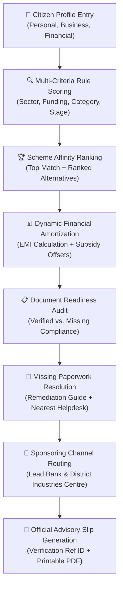

<div align="center">

# 🇮🇳 JANSAHAY AI
### **AI-Powered Scheme Matching, Financial Planning & Channel Partner Routing**
**Smart India Hackathon 2026 Prototype**  
**Problem Statement ID: SIH26092 — AI Driven Scheme Matching for Marginal Entrepreneurs**

[](https://react.dev/)
[](https://www.typescriptlang.org/)
[](https://vitejs.dev/)
[](https://tailwindcss.com/)
[](https://sih.gov.in)
[](https://github.com/Sanjay190806/MindTwister)

---

*"Empowering India's marginal, micro and nano-entrepreneurs to discover government credit schemes, understand net financial burden, resolve document gaps, and connect with nodal facilitation desks."*

</div>

---

## 📑 Table of Contents
1. [Executive Summary](#-executive-summary)
2. [Problem Statement (SIH26092)](#-problem-statement-sih26092)
3. [Core Solution Workflow](#-core-solution-workflow)
4. [Key Features & Capabilities](#-key-features--capabilities)
5. [Evaluated Central Government Schemes](#-evaluated-central-government-schemes)
6. [Pre-Loaded Demonstration Personas](#-pre-loaded-demonstration-personas)
7. [Mathematical Financial Modeling](#-mathematical-financial-modeling)
8. [Technical Architecture & Project Structure](#-technical-architecture--project-structure)
9. [Getting Started & Local Setup](#-getting-started--local-setup)
10. [Hackathon Demo Presentation Script](#-hackathon-demo-presentation-script)
11. [Compliance & Prototype Disclaimer](#-compliance--prototype-disclaimer)

---

## 🎯 Executive Summary
Millions of micro-entrepreneurs, self-employed workers, rural artisans, and small business owners across India struggle to access government support schemes. While initiatives like **PMEGP, MUDRA, Stand-Up India, and PM Vishwakarma** offer substantial capital subsidies and collateral-free institutional finance, grassroots entrepreneurs face significant informational friction:

- **Complex Eligibility Rules**: Difficulty understanding sector reservations, demographic incentives, and educational caveats.
- **Hidden Financial Calculations**: Confusion between gross loans, interest rates, capital subsidies, and actual monthly EMI outflows.
- **Paperwork Roadblocks**: Disqualification due to missing paperwork (e.g., Udyam Registration or project costing reports) without clear remediation guidance.
- **Channel Confusion**: Unclear understanding of where to submit applications—whether to District Industries Centres (DICs), Lead Bank Branches, or MSME-DFOs.

**JANSAHAY AI** is an intelligent, accessible, citizen-first prototype that eliminates this friction through rule-driven suitability scoring, transparent EMI and capital subsidy amortization, document deficit mapping, and physical facilitation centre routing.

---

## 🏛️ Problem Statement (SIH26092)
- **Title**: AI Driven Scheme Matching for Marginal Entrepreneurs
- **Focus Category**: Smart India Hackathon 2026 — Inclusive Growth & Financial Inclusion
- **Target Beneficiaries**: Nano-business owners, street vendors, rural SHG members, artisanal craftspeople, and first-generation micro-entrepreneurs.

---

## 🔄 Core Solution Workflow



---

## 🌟 Key Features & Capabilities

### 1. 5-Step Guided Assessment Wizard
- **Step 1: Personal Profile**: Name, age, gender, state, district, PIN code, social category (*General/OBC/SC/ST/Minority*), special category (*Women, Divyangjan, Ex-Serviceman, NER/Hilly*), and entrepreneur classification.
- **Step 2: Business Profile**: Enterprise name, business location (*Urban/Semi-Urban/Rural*), sector classification (*Manufacturing, Food Processing, Services, Trading, Handicrafts, Agri-Allied*), operational stage (*Idea, New, Existing, Expansion*), workforce size, and annual revenue.
- **Step 3: Financial Profile**: Funding required, loan amount preference, repayment tenure preference (1–10 years), existing loan liabilities, collateral availability, and credit bureau track record.
- **Step 4: Document Readiness Audit**: 13-point compliance checklist with interactive toggle switches (*Available vs. Missing*) and simulated digital uploads.
- **Step 5: Review & Simulated AI Engine**: Comprehensive profile review with instant edit shortcuts and a 5-stage animated progress simulation benchmarking 8 central frameworks.

### 2. Explainable Rule-Based Scheme Matching
Rather than operating as an opaque black box, JANSAHAY AI provides **transparent explainability**:
- **Weighted Rule Dimensions**:
  - Business Sector Alignment: **20 points**
  - Funding Band Alignment: **20 points**
  - Business Operational Stage: **15 points**
  - Entrepreneur Demographics & Category: **15 points**
  - Location Feasibility: **10 points**
  - Credit & Cash Flow Viability: **10 points**
  - Document Readiness: **10 points**
- **Categorical Match Tiers**:
  - `90% – 100%`: **Highly Suitable**
  - `75% – 89%`: **Strong Match**
  - `60% – 74%`: **Potential Match**
  - `Below 60%`: **Limited Match**
- Visual horizontal breakdown bars and natural-language justifications explain exactly why a scheme was recommended.

### 3. Dynamic Financial Modeling & Interactive EMI Calculator
- Real-time monthly installment calculation using standard banking amortization formulas.
- Live interactive sliders for loan principal, interest rate benchmark, and tenure.
- **True Net Financial Burden Breakdown**:
  $$\text{Net Financial Burden} = \text{Principal Loan} + \text{Total Interest Outlay} - \text{Capital Subsidy}$$
- Principal vs. Interest graphical distribution bar.

### 4. "What-If" Subsidy Optimization Simulator
- Proactively shows how operational decisions affect government capital grants.
- Allows entrepreneurs to test:
  - *What if the unit is located in a Rural/Panchayat area?* (+10% subsidy bonus under PMEGP).
  - *What if the enterprise is registered under Special/Women ownership?* (+10% bonus).
- Real-time comparison between baseline subsidy and optimized tier with a single-click *"Apply Scenario"* action.

### 5. Document Readiness & Missing Paperwork Resolution
- Identifies missing mandatory documents (e.g., Udyam Registration Certificate).
- Provides actionable instructions on how to obtain missing certificates online free of cost.
- **Nearest Physical Facilitation Helpdesk**: Connects the entrepreneur directly with the closest District Industries Centre (e.g., Ambattur DIC for Chennai users) with contact numbers, opening hours, on-site services, and simulated GPS navigation.

### 6. Official Advisory Slip Generation (Dossier Slip)
- Generates a branded, printable **JANSAHAY AI Scheme Advisory Dossier Slip**.
- Includes applicant parameters, match score, financial terms, reference verification code (e.g., `JSAI-2026-CHE-89211`), security barcode graphic, and one-click PDF printing.

### 7. Side-by-Side Scheme Comparison Matrix
- Compare up to 3 central schemes simultaneously across:
  - Match score and suitability tier
  - Implementing ministry and category
  - Minimum and maximum funding ceilings
  - Indicative interest rates and loan tenures
  - Capital subsidy percentages and margin money rules
  - Collateral requirements (*Collateral-free guarantees vs. standard*)
  - Target business sectors and essential paperwork

### 8. Vernacular Language Support
- Built-in multi-language toggle supporting **English**, **हिन्दी (Hindi)**, and **தமிழ் (Tamil)**.
- Tailored for grassroots accessibility across diverse linguistic communities in India.

---

## 📜 Evaluated Central Government Schemes

| Scheme Code | Full Scheme Name | Nodal Ministry | Funding Ceiling | Indicative Rate | Subsidy / Incentive |
|---|---|---|---|---|---|
| **PMEGP** | Prime Minister's Employment Generation Programme | Ministry of MSME / KVIC | Up to ₹50 Lakh (Mfg) / ₹20 Lakh (Service) | 8.5% p.a. | 15%–35% Capital Margin Money Subsidy |
| **PMMY Tarun** | Pradhan Mantri MUDRA Yojana (Tarun) | Ministry of Finance / DFS | ₹5 Lakh – ₹10 Lakh (ext. ₹20 Lakh) | 9.2% p.a. | 100% Collateral-Free Credit Guarantee (NCGTC) |
| **PMMY Kishore** | Pradhan Mantri MUDRA Yojana (Kishore) | Ministry of Finance / DFS | ₹50,000 – ₹5 Lakh | 8.8% p.a. | Collateral-Free Micro-Finance |
| **Stand-Up India** | Stand-Up India Scheme for SC/ST & Women | Ministry of Finance / SIDBI | ₹10 Lakh – ₹1 Crore | 8.75% p.a. | 15% Margin Money Convergence + 7 Yr Tenure |
| **CGTMSE** | Credit Guarantee Scheme for Micro & Small Enterprises | Ministry of MSME & SIDBI | Up to ₹5 Crore | 9.5% p.a. | Up to 85% Central Guarantee Cover |
| **PM Vishwakarma** | PM Vishwakarma Artisan Support Scheme | Ministry of MSME & Skill Dev | Up to ₹3 Lakh | 5.0% p.a. | 8% Interest Subvention + ₹15,000 Toolkit Voucher |
| **DAY-NULM** | National Urban Livelihoods Mission (SEP) | Ministry of Housing & Urban Affairs | Up to ₹2 Lakh (Individual) | 7.0% p.a. | Interest Subvention for rate above 7% |
| **CLCSS** | Credit Linked Capital Subsidy Scheme | Ministry of MSME | Up to ₹1 Crore | 9.0% p.a. | 15% Upfront Capital Subsidy for Tech Upgrades |

---

## 👥 Pre-Loaded Demonstration Personas

To enable seamless hackathon jury evaluations without manual form entry, JANSAHAY AI includes 3 pre-configured personas:

### 1. Arun Kumar (Primary Evaluation Persona)
- **Age / Location**: 32 Years • Chennai, Tamil Nadu (Urban)
- **Category**: OBC • Existing Business Owner
- **Business**: *Sri Sai Packaged Foods & Condiments* (Food Processing • 3 Years Operational • 6 Employees)
- **Financials**: ₹12,00,000 Annual Revenue • ₹5,00,000 Required Funding • 5 Years Preferred Tenure
- **Status**: No Collateral • Good Credit Record • 8/10 Documents Ready (**Udyam Registration Missing**)
- **Matching Result**: **PMEGP at 94% ("Highly Suitable")**; routes missing Udyam to **Ambattur DIC Facilitation Desk (4.2 km)**.

### 2. Pooja Sharma (Women Artisan Persona)
- **Age / Location**: 29 Years • Jaipur, Rajasthan (Semi-Urban)
- **Category**: General (Women Entrepreneur) • New Entrepreneur
- **Business**: *Vedic Threads Handloom & Apparel* (Handicraft Block Printing • 4 Employees)
- **Financials**: ₹4,50,000 Annual Revenue • ₹3,00,000 Required Funding • 4 Years Preferred Tenure
- **Matching Result**: **Stand-Up India & PM Vishwakarma** prioritization.

### 3. Ramesh Yadav (Rural Agri-Allied Persona)
- **Age / Location**: 41 Years • Varanasi, Uttar Pradesh (Rural)
- **Category**: OBC • Self-Employed Micro Entrepreneur
- **Business**: *Kashi Agro Services & Seed Processing* (Agriculture Allied)
- **Financials**: ₹8,50,000 Annual Revenue • ₹4,00,000 Funding Required • Rural Location
- **Matching Result**: **PMEGP (Rural 35% Capital Subsidy Tier) & MUDRA Kishore**.

---

## 🧮 Mathematical Financial Modeling

Monthly equated installments (EMI) are calculated dynamically using the standard banking amortization equation:

$$\text{EMI} = \frac{P \times r \times (1+r)^n}{(1+r)^n - 1}$$

Where:
- $P$ = Principal loan amount
- $r$ = Monthly interest rate ($\frac{\text{Annual Rate}}{12 \times 100}$)
- $n$ = Total repayment periods in months ($\text{Tenure in Years} \times 12$)

**Capital Subsidy & Net Financial Burden Offset:**
$$\text{Estimated Subsidy} = P \times \frac{\text{Subsidy Rate}\%}{100}$$
$$\text{Net Burden} = ( \text{EMI} \times n ) - \text{Estimated Subsidy}$$

---

## 💻 Technical Architecture & Project Structure

```
JanSahay AI/
├── index.html                    # Base HTML entry with Inter typography & GOI styling
├── package.json                  # React 19, TypeScript, Tailwind, Lucide, Router
├── tailwind.config.js            # National theme colors (gov-navy, saffron, green)
├── tsconfig.json                 # TypeScript compiler configuration
├── vite.config.ts                # Vite build pipeline
└── src/
    ├── App.tsx                   # Main route coordinator & global context wrapper
    ├── main.tsx                  # Application mount
    ├── index.css                 # Base Tailwind imports & government styling
    ├── types/
    │   └── index.ts              # TypeScript interfaces (Schemes, Profile, Scores)
    ├── data/
    │   ├── schemes.ts            # 8 Central MSME mock schemes & 13 master documents
    │   ├── centres.ts            # DIC, MSME-DFO & e-Seva physical helpdesk registry
    │   └── mockUser.ts           # Pre-loaded SIH test personas (Arun, Pooja, Ramesh)
    ├── utils/
    │   ├── eligibility.ts        # Weighted rule-based matching engine
    │   ├── finance.ts            # Dynamic EMI, amortization & Indian INR formatting
    │   └── translations.ts       # English, Hindi & Tamil vernacular dictionaries
    ├── context/
    │   └── AssessmentContext.tsx  # Central state management & simulation coordinator
    ├── components/
    │   ├── Header.tsx            # Tricolor accent banner, persona switcher & lang dropdown
    │   ├── Footer.tsx            # Digital India footer & prototype compliance notices
    │   ├── DisclaimerBanner.tsx  # Non-intrusive SIH prototype alert banner
    │   ├── LoadingAnalysis.tsx   # 5-stage animated AI evaluation modal
    │   ├── SupportCentresModal.tsx# Physical helpdesk directory with demo GPS routing
    │   ├── SchemeCompareModal.tsx# Side-by-side scheme comparison matrix
    │   ├── assessment/
    │   │   ├── StepPersonal.tsx  # Step 1: Personal demographics
    │   │   ├── StepBusiness.tsx  # Step 2: Enterprise activity & location
    │   │   ├── StepFinancial.tsx # Step 3: Funding requirements & tenure
    │   │   ├── StepDocuments.tsx # Step 4: 13-point document readiness audit
    │   │   └── StepReview.tsx    # Step 5: Profile review & engine trigger
    │   └── results/
    │       ├── TopRecommendationCard.tsx    # Highlighted primary recommendation
    │       ├── FinancialCalculatorSection.tsx# Interactive EMI sliders & net burden
    │       ├── WhatIfSubsidySimulator.tsx    # Rural & demographic grant optimizer
    │       ├── ExplainabilitySection.tsx     # 5 horizontal breakdown progress bars
    │       ├── DocumentReadinessSection.tsx  # Missing document alerts & resolution
    │       ├── ChannelPartnerSection.tsx     # Sponsoring bank & Ambattur DIC preview
    │       ├── ApplicationGuidanceTimeline.tsx# 6-step procedural roadmap
    │       ├── OtherSuitableSchemes.tsx      # Ranked alternative scheme cards
    │       └── RecommendationSlipModal.tsx   # Printable official advisory dossier slip
    └── pages/
        ├── HomePage.tsx          # Landing portal with visual journey diagram
        ├── AssessmentPage.tsx    # Multi-step wizard coordinator
        ├── ResultsPage.tsx       # Centerpiece recommendation & financial dashboard
        ├── SchemesExplorerPage.tsx# Search & multi-category filter catalog
        ├── SchemeDetailPage.tsx  # Complete scheme dossier & guidelines
        └── DashboardPage.tsx     # Citizen control center & action checklist
```

---

## 🚀 Getting Started & Local Setup

### Prerequisites
- [Node.js](https://nodejs.org/) v18 or higher
- [npm](https://www.npmjs.com/) v9 or higher

### Installation & Execution
```bash
# 1. Clone this repository
git clone https://github.com/Sanjay190806/MindTwister.git
cd MindTwister

# 2. Install all dependencies
npm install

# 3. Launch the Vite development server
npm run dev
```

Open **`http://localhost:5173`** in any modern web browser.

### Production Build
```bash
npm run build
```
Generates clean, minified production assets in the `dist/` directory.

---

## 🎤 Hackathon Demo Presentation Script (3-Minute Flow)

When presenting JANSAHAY AI to the Smart India Hackathon jury, follow this recommended walkthrough:

1. **Minute 0:00 – 0:45 (The Problem & Landing Portal)**:
   - Introduce **Problem Statement SIH26092**: *"Marginal entrepreneurs in India are held back not by lack of initiative, but by informational asymmetry regarding government support schemes."*
   - Showcase the landing page with its tricolor theme, government-service aesthetics, and vernacular language switcher (toggle to **हिन्दी** or **தமிழ்**).
2. **Minute 0:45 – 1:30 (Assessment & AI Matching)**:
   - Click **"Demo Persona: Arun Kumar"** in the top navigation to instantly pre-fill realistic micro-entrepreneur data (Chennai food processor needing ₹5L).
   - Navigate through the 5-step wizard to Step 5 and click **"Analyze My Eligibility"**.
   - Highlight the animated 5-stage simulation demonstrating multi-criteria scoring.
3. **Minute 1:30 – 2:30 (Results, Financial Plan & What-If Simulator)**:
   - Present the **PMEGP 94% Recommendation**: Show the 5 specific matching reasons and the explainability breakdown bars.
   - Interact with the **EMI Calculator**: Adjust the tenure and interest sliders to display dynamic monthly installments and the capital subsidy offset.
   - Open the **What-If Subsidy Simulator**: Show how moving to a rural location or registering under special category increases the subsidy from 25% to 35% (+₹50,000 savings!).
4. **Minute 2:30 – 3:00 (Document Remediation & Advisory Slip)**:
   - Point out the **Missing Udyam Registration** alert and click **"Find Nearest Support Centre"** to display the **Ambattur DIC Helpdesk (4.2 km away)**.
   - Click **"Official Advisory Slip"** to present the downloadable/printable digital dossier with unique reference ID.

---

## ⚖️ Compliance & Prototype Disclaimer

> [!IMPORTANT]
> **Smart India Hackathon 2026 Prototype Notice:**  
> JANSAHAY AI is a demonstration prototype developed for **Smart India Hackathon 2026 (Problem Code: SIH26092)**. All scheme parameters, eligibility analysis, interest rates, capital subsidies, and service-centre locations shown in this application use mock demonstration rules and are provided strictly for evaluation purposes. Final eligibility determinations, loan sanctions, margin money disbursements, and terms are governed exclusively by the respective official Government of India ministries, nodal agencies (KVIC, SIDBI), and lending financial institutions.

---

<div align="center">

**Developed with ❤️ for Smart India Hackathon 2026**  
*Empowering Marginal Entrepreneurs Across Bharat*

</div>
